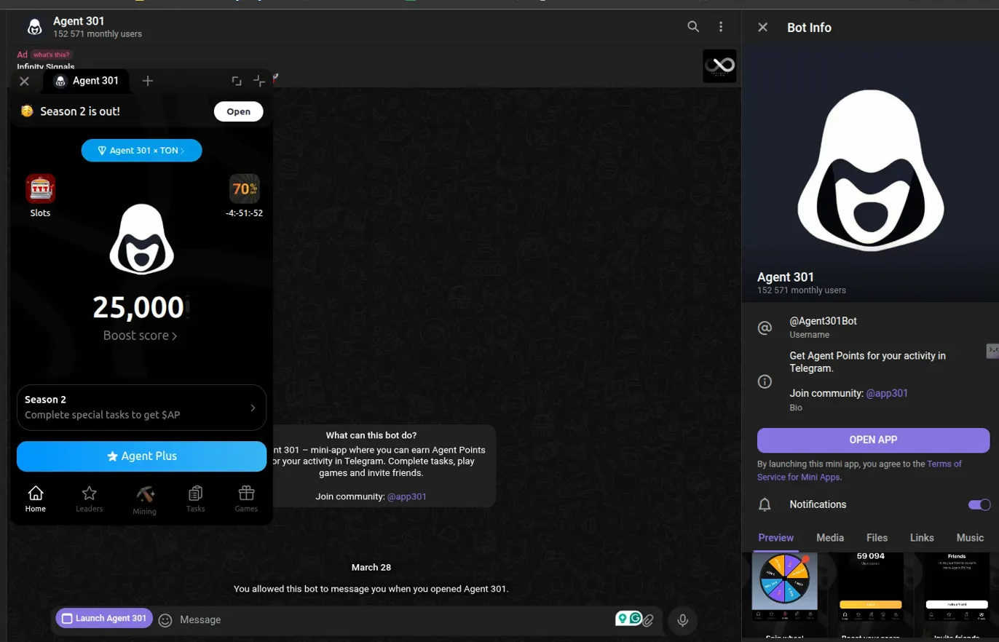

<goal>
I want to build a Telegram Mini App (formerly known as Telegram Web App) - specifically a gamified points/rewards system similar to Agent 301.

Use this folder (repository) as a source code for both FE and BE. 
Use can divide to seperated sub folder if needed

App should be very simple first. Just adapt a full flow from BE-FE-API_BOT is enough
</goal>